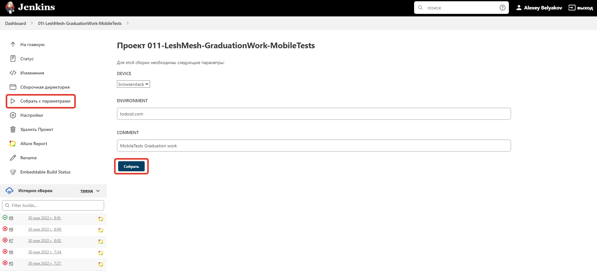
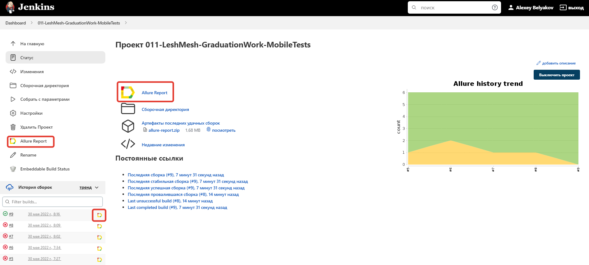
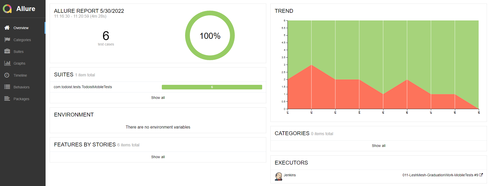
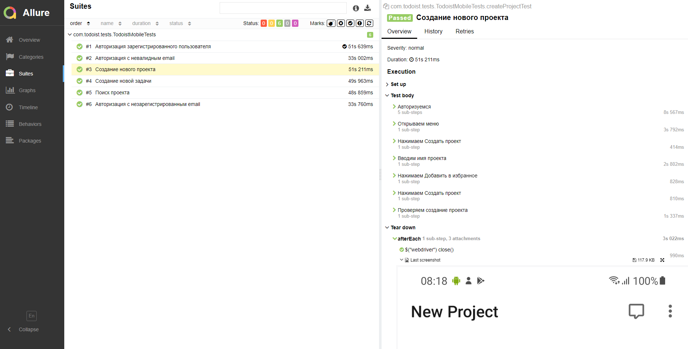
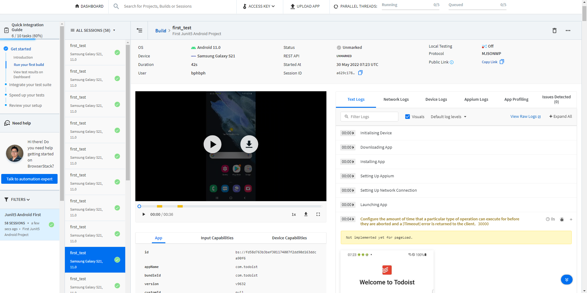
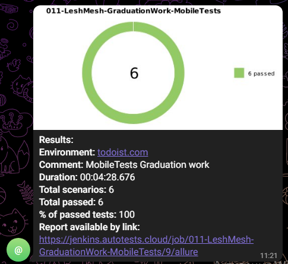

# Дипломный проект по автоматизации тестирования сайта [Todoist](http://todoist.com/ru/)
Реализован во время обучения в Школе инженеров по автоматизации тестирования [qa.guru](http://qa.guru/)

## Технологии и инструменты
<p align="left"> 
<a href="https://www.jetbrains.com/idea/" target="_blank" rel="noreferrer">  </a>
<a href="https://www.oracle.com/java/" target="_blank" rel="noreferrer">  </a>
<a href="https://gradle.org/" target="_blank" rel="noreferrer">  </a>
<a href="https://junit.org/junit5/" target="_blank" rel="noreferrer">  </a>
<a href="https://selenide.org/" target="_blank" rel="noreferrer">  </a>
<a href="https://www.browserstack.com/" target="_blank" rel="noreferrer">  </a>
<a href="https://qameta.io/allure-report/" target="_blank" rel="noreferrer">  </a> 
<a href="https://www.jenkins.io/" target="_blank" rel="noreferrer">  </a>
<a href="https://git-scm.com/" target="_blank" rel="noreferrer">  </a>
<a href="https://telegram.org/" target="_blank" rel="noreferrer">  </a>

> *В данном проекте автотесты написаны на <code><strong>*Java*</strong></code> с использованием фреймворков <code><strong>*Selenide*</strong></code> и <code><strong>*Appium*</strong></code>*
>
> *Для сборки проекта используется <code><strong>*Gradle*</strong></code>.*
>
> *<code><strong>*JUnit 5*</strong></code> используется как фреймворк для модульного тестирования.*
>
> *Запуск тестов выполняется из <code><strong>*Jenkins*</strong></code>.*
>
> *<code><strong>*Browserstack*</strong></code> используется для запуска мобильного приложения.*
>
> *<code><strong>*Allure Report, Telegram Bot*</strong></code> используются для визуализации результатов тестирования.*
  
## Реализованы проверки

- [x] Авторизация зарегистрированного пользователя
- [x] Авторизация с невалидным email
- [x] Авторизация с незарегистрированным email
- [x] Создание новой задачи 
- [x] Создание нового проекта
- [x] Поиск проекта

## Запуск тестов из терминала

*Запуск тестов осуществляется командой:*

```bash
gradle clean test 
  -DdeviceHost=browserstack
```

где:
>- [x] *DdeviceHost - Устройство, на котором выполняется запуск тестов (Browserstack)*
  
## Запуск тестов в [Jenkins](https://jenkins.autotests.cloud/job/011-LeshMesh-GraduationWork-MobileTests)
*Для запуска сборки необходимо указать значения параметров и нажать кнопку <code><strong>*Собрать*</strong></code>.*
 
<p align="center">
  
</p>

*После выполнения сборки, в блоке <code><strong>*История сборок*</strong></code> напротив номера сборки появится
значок <code><strong>*Allure
Report*</strong></code>, кликнув по которому, откроется страница со сформированным отчетом.*

<p align="center">
  
</p>

## Отчет о результатах тестирования в [Allure Report](https://jenkins.autotests.cloud/job/011-LeshMesh-GraduationWork-UiTests/27/allure/#)

<p align="center">
  
</p>

### Список тестов c описанием шагов и визуализацией результатов
  
<p align="center">
  
</p>

## Пример запуска тестов в Browserstack

<p align="center">
  
</p>

## Пример запуска теста в Selenoid
> К каждому тесту в отчете прилагается видео.

<p align="center">

</p>
  
## Уведомления в Telegram
> После завершения сборки специальный бот, созданный в <code>Telegram</code>, автоматически обрабатывает и отправляет сообщение с отчетом о прогоне.

<p align="center">
  
</p>

